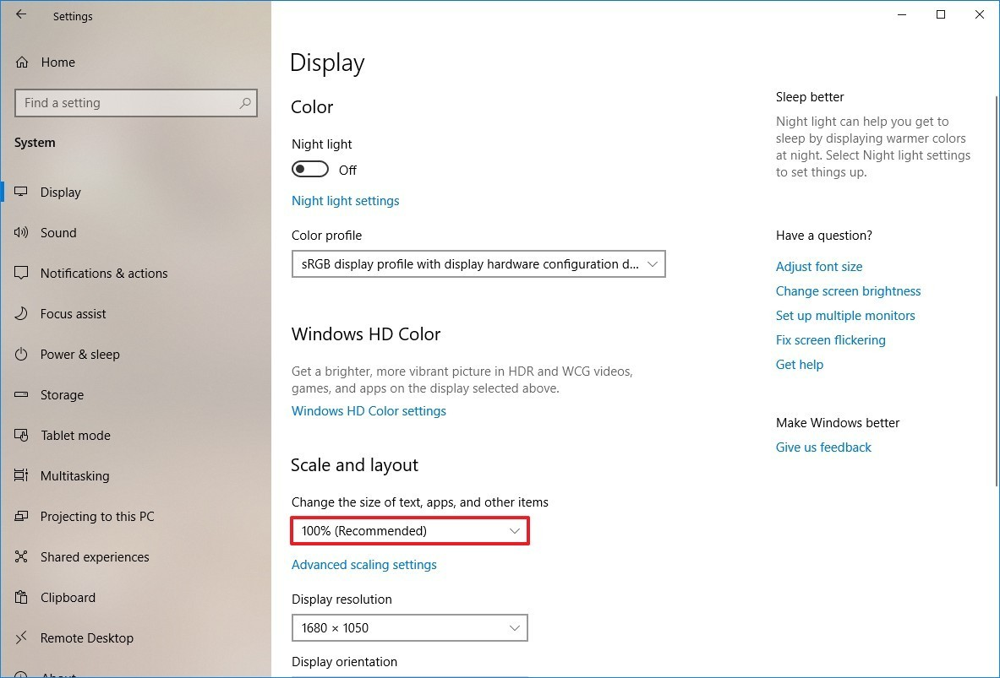

An example of creating an AI in .Net using ([Unity ML-Agents][unityMlAgents]) and a 3D Pinball game, to serve as a learning environment for training intelligent agents to play pinball without supervision.

The Pinball agent is rewarded by the score going up, and all actions and frames that lead to a higher score are remembered. Initially the actions will be random (using a curiosity model) but over time the agent will choose actions that lead to the highest reward (score).

## Prerequisites
- Download and install ['3D Pinball'][3DPinball]{:target="_blank"}
- Download, install and configure [Unity][unity]{:target="_blank"} 
- Setup a ([Python 3.6 Virtual Environment](docs/using-virtual-environments.md))

## Training the PinballAgents
- Setup a ([training session](docs/training-ML-agents.md))

## The Code
- The brain ([Pinball Agent](Assets/Scripts/PinballAgent.cs)) implemented in .Net
- The eyes ([External Window Manager](Assets/Scripts/ExternalWindowManager.cs)) used to screen capture external window, and send keys to it. You could say one eye watches the window frames and the other looks at the score.
- The AI config ([trainer_config.yaml](Assets/Config/trainer_config.yaml)) the unity ML agents training config.

## Features
- A PinballAgent that can learn from an external game (3D Pinball) by watching the screen as a visual observation.
- (TODO:) Use behaviour cloning to watch a recording of the highest Pinball score
- (TODO:) Fix scaling limitation.

## Limitation
- The Pinball Game Window must be in focus during training, with no windows overlapping it.
- Currently the PinballAgent can only read the score when Windows is set to 100% scale when training. 
This is due to the method chosen for detecting the score by comparing pixels.

### How to change display scaling settings using recommended values
To change a display scaling size using the recommended settings, use these steps:
1. Open Settings.
2. Click on System.
3. Click on Display.
4. Under the "Scale and layout" section, use the drop-down menu and select the 100% scale setting.

## Additional Resources
* [Unity ML-Agents][unityMlAgents]

## Contributing

This project welcomes contributions and suggestions.  Most contributions require you to agree to a
Contributor License Agreement (CLA) declaring that you have the right to, and actually do, grant us
the rights to use your contribution. For details, visit https://cla.opensource.microsoft.com.

When you submit a pull request, a CLA bot will automatically determine whether you need to provide
a CLA and decorate the PR appropriately (e.g., status check, comment). Simply follow the instructions
provided by the bot. You will only need to do this once across all repos using our CLA.

This project has adopted the [Microsoft Open Source Code of Conduct](https://opensource.microsoft.com/codeofconduct/).
For more information see the [Code of Conduct FAQ](https://opensource.microsoft.com/codeofconduct/faq/) or
contact [opencode@microsoft.com](mailto:opencode@microsoft.com) with any additional questions or comments.

## Credit
Initial concept and code developed by [Elliot Wood][elliotGithub]

<!-- Links -->
[elliotGithub]: https://github.com/ElliotWood "Elliot's GitHub"
[unityMlAgents]: https://github.com/Unity-Technologies/ml-agents "Unity ML Agents GitHub repo"
[3DPinball]: https://www.groovypost.com/howto/windows-7-3d-pinball-space-cadet-game/ "3D Pinball"
[unity]: ./docs/unity-setup.md "Unity Setup Instructions"
