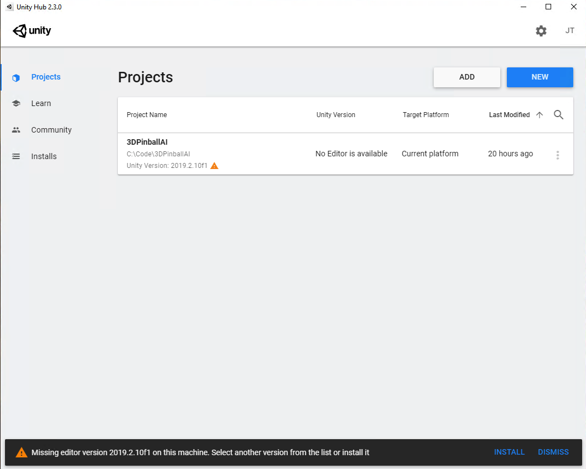

# Unity Setup

## Install Unity
1. Download and install [Unity Hub][unityHub] if you don't have it already.
2. Run Unity Hub, and select the Projects tab
3. Click "ADD" and select the location of this Project
4. If you don't already have Unity 2019.2.10f1 installed, selecting the project will prompt you to install it. - Click install if required.

5. Click install if required, and ensure that you allow Unity to install Visual Studio 19 Community Edition.
6. Once installed, you can return to the Projects tab and open this Project by locating the folder you cloned this Repo to
7. Install the ML-Agents packages (see below)
8. Ensure Baracuda Package Manager is installed (see more below)

## ML-Agents Packages

We're using an older version of ML-Agents which gives us the ability to interface with the underlying Python ML code using .NET in Unity. Because of the age of the version we're using, a manual install of the package files is required.

1. Grab the code from https://github.com/Unity-Technologies/ml-agents/tree/release-0.12.0 (you can either clone of download the zip)
2. From the `ml-agents-0.12.0\UnitySDK\Assets\ML-Agents` folder, copy everything except the `Examples` folder into `Assets\ML-Agents` in the folder where you've downloaded this repo. This file is marked with `PlaceHolder.txt` to help you find it.

## Barracuda Package

ML-Agents version 0.12 takes a dependency on the "Barracuda" package in the Unity Package Manager. 

1. Open the Pinball project in Unity
1. From the menu bar, go to "Window" > "Package Manager"
1. Click "Advanced" and choose "Show preview packages"
1. Search for the "Barracuda" package
1. Expand and choose "see all versions"
1. Select version "preview - 0.4.0"
1. Click "Update to 0.4.0-preview" and allow the installation to complete

<!-- Links -->
[unityHub]: https://unity3d.com/get-unity/download "Unity Hub 2.3.0 download"
